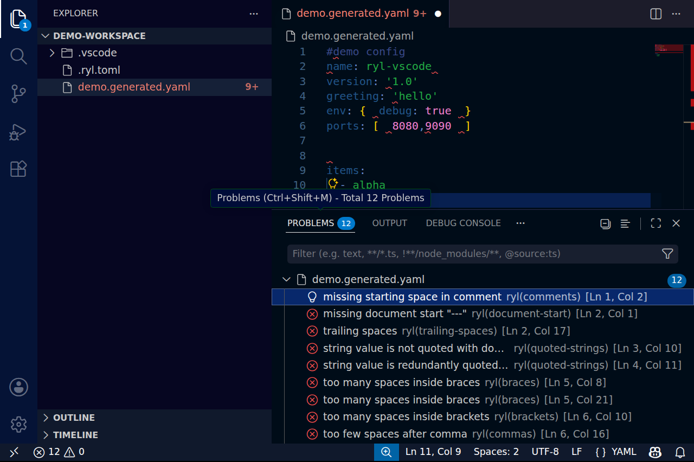

# Editor integration (language server)

`ryl server` runs ryl as a [Language Server Protocol](https://microsoft.github.io/language-server-protocol/)
(LSP) server over stdio, so any LSP-capable editor gets ryl's diagnostics and fixes inline
as you type. It is the same lint and fix engine as the CLI, exposed over the protocol.

A ryl language server is a **linter** provider. It is meant to run *alongside* Red Hat's
[`yaml-language-server`](https://github.com/redhat-developer/yaml-language-server) (schema
validation, completion, schema hover), the way Ruff runs alongside Pylance: editors attach
both and merge their diagnostics. ryl does not do schema validation or completion; its
hover only explains ryl's own diagnostics.

## What it provides

| Capability | LSP feature | Behaviour |
| --- | --- | --- |
| Diagnostics (push) | `textDocument/publishDiagnostics` | Every enabled rule, re-linted on open and on each change. Sent only to a client that does *not* advertise the pull model (see below) |
| Diagnostics (pull) | `textDocument/diagnostic`, `workspace/diagnostic` | On-demand diagnostics for one document or every `*.yaml`/`*.yml` under the workspace root |
| Fix all | `source.fixAll.ryl` code action | Applies every safe fix to the document (the `--fix` set) |
| Fix all of one rule | `source.fixAll.ryl.<rule>` code action | Applies just one safe-fixable rule's fixes (offered per rule with a diagnostic) |
| Disable a rule | `quickfix` code action | Inserts `# ryl disable-line rule:<rule>` (per line) or a first-line `# ryl disable-file` (whole file) |
| Formatting | `textDocument/formatting` | Same as "fix all": formatting *is* applying safe fixes |
| Hover | `textDocument/hover` | The rule and message for a diagnostic under the cursor, with a link to the rules reference |
| Rename | `textDocument/rename`, `textDocument/prepareRename` | Rename a YAML anchor/alias and every same-name use in its document |
| Config watching | `workspace/didChangeWatchedFiles` | When a ryl/yamllint config file changes on disk, re-lints open documents (push clients) or asks pull clients to re-pull via `workspace/diagnostic/refresh` |

The fix-all action and formatting both apply ryl's whole-file safe fixes; ryl has no
per-occurrence "fix just this one" action, because its fix engine operates per file (the
per-rule fix-all is the finest grain available, and applies only to YAML, not Markdown). A
document that does not parse is never modified (the same guarantee as `ryl --fix`).

## Running it

```console
$ ryl server
```

The server speaks LSP over stdin/stdout; you do not run it directly but point your editor's
LSP client at the command. (`server` is a subcommand, so to lint a path literally named
`server` use `ryl ./server` or `ryl server/`.) Configuration is discovered per document exactly as the CLI does
it (a `.ryl.toml` / `ryl.toml` / `[tool.ryl]` in `pyproject.toml`, or a yamllint config,
found by walking up from the file). As with the CLI, **ryl enables no rules by default**: a
file with no discovered config that enables at least one rule produces no diagnostics.

YAML and Markdown (embedded YAML) documents are both supported; the source kind is resolved
from your `[files]` globs just like the CLI. An untitled (unsaved) buffer is linted as YAML,
with config discovery anchored at the workspace root.

## Configuring it from the editor

The server reads optional settings from the client, either in `initializationOptions` at
startup or via a `workspace/didChangeConfiguration` notification (a `ryl` section is
accepted, so `{"ryl": {...}}` and a bare `{...}` both work). Changing them re-lints open
documents:

| Setting | Effect |
| --- | --- |
| `enable` (bool, default `true`) | `false` turns ryl off: no diagnostics, no actions |
| `configPath` (string) | Use this config file instead of discovering one (like `ryl -c`) |
| `configData` (string) | Inline YAML config text, highest precedence (like `ryl -d`) |

These are the same precedence as the CLI: `configData` > `configPath` > the discovered
project/user config.

## Neovim

Neovim has a built-in LSP client. Until a `nvim-lspconfig` entry exists, register ryl
manually, for example:

```lua
vim.api.nvim_create_autocmd("FileType", {
  pattern = { "yaml", "markdown" },
  callback = function(args)
    vim.lsp.start({
      name = "ryl",
      cmd = { "ryl", "server" },
      root_dir = vim.fs.root(args.buf, { ".ryl.toml", "ryl.toml", ".git" }),
    })
  end,
})
```

Trigger the fix-all action with `vim.lsp.buf.code_action()`, or format with
`vim.lsp.buf.format()`.

## VS Code

The **ryl VS Code extension** (`owenlamont.ryl`) is published on the
[VS Marketplace](https://marketplace.visualstudio.com/items?itemName=owenlamont.ryl) and
[Open VSX](https://open-vsx.org/extension/owenlamont/ryl). It is a thin client that runs
`ryl server`, so the linting, fixing, and formatting all come from ryl itself. A
platform-specific ryl binary is bundled, so it works with no separate install; if you
already have ryl on your `PATH` or in a project environment, it uses that instead.



It surfaces the language-server features described above - live diagnostics, fix-all (and
per-rule fix-all), the disable-rule quick fixes, hover, and anchor/alias rename - and adds a
`ryl.fixAll` command and a fix-on-save option. To make ryl your YAML formatter and apply
safe fixes on save:

```json
{
  "[yaml]": {
    "editor.defaultFormatter": "owenlamont.ryl",
    "editor.formatOnSave": true,
    "editor.codeActionsOnSave": {
      "source.fixAll.ryl": "explicit"
    }
  }
}
```

Like the CLI, it enables no rules until it discovers a config that turns some on. Source and
issue tracker: [owenlamont/ryl-vscode](https://github.com/owenlamont/ryl-vscode).

## Notes

- **Position encoding** is negotiated at startup (UTF-8, UTF-16, or UTF-32); ryl supports
  all three and defaults to UTF-16 when the client states no preference, so columns line up
  correctly even for multi-byte and astral-plane characters.
- **Config watching** re-lints open documents when a ryl/yamllint config file changes on
  disk, for clients that support dynamic `didChangeWatchedFiles` registration. It watches
  the standard config filenames anywhere in the workspace plus an explicit `configPath`;
  files pulled in via a config's `extends:` are not individually watched, so re-open a
  document to refresh after editing those. A client without the capability simply picks up
  a config change on the next edit or re-open.
- **Document sync is incremental** — the editor sends only the edited range — but ryl
  re-lints the whole reconstructed document each time (it is fast enough that this is
  invisible).
- **Disable-rule actions** insert a `# ryl disable-line` comment on its own line. A
  diagnostic *inside* a block scalar gets no disable-line action (a `#` there would be
  scalar content, not a directive) — use the whole-file disable or a config-level ignore
  for those.
- **Rename** targets YAML anchors/aliases only (not Markdown-embedded YAML), and is scoped
  to the document the anchor lives in: a name reused across a `---`/`...` boundary is a
  distinct anchor and is left untouched.
- **Push vs pull is chosen per client, never both.** The server advertises the pull model
  (`textDocument/diagnostic`) *and* can push (`textDocument/publishDiagnostics`), but emits
  only one per document: if the client advertises pull support, the server relies on pull and
  does not push. The LSP spec does not say how the two models interact when a server supports
  both, and clients that keep them in separate diagnostic collections (VS Code via
  `vscode-languageclient`) would otherwise show every problem twice. A client that does not
  advertise pull (older editors) still gets pushes as before. After a config change, a pull
  client is asked to re-pull via `workspace/diagnostic/refresh` (if it advertised
  `refreshSupport`), since its gated-off push results would otherwise leave stale diagnostics
  on screen; a pull client without that capability re-pulls only on its own cadence.
- **Workspace pull diagnostics** cover `*.yaml`/`*.yml` files under each workspace root
  (git-ignored files excluded); Markdown and files matched only by custom `[files]` globs
  are diagnosed when opened or pulled individually. The scan runs on a background thread
  (so editing, hover, and other requests stay responsive while it works) and lints files
  in parallel across CPU cores. A new pull supersedes any in-flight one, and a
  `$/cancelRequest` (and shutdown) stops it promptly: the directory walk is cancelled
  per entry and the lint pass is fast, so only an in-progress single-file read is not
  interrupted.
- **Disable-rule actions are offered for YAML documents only** — in Markdown the
  diagnostic's line is a host-file line whose embedded YAML carries a prefix, so a raw
  comment insert would be unreliable; Markdown documents get the fix-all action (which is
  region-aware) instead.
- A missing config or one that enables no rules produces **no diagnostics** — the editor
  stays quiet, matching ryl's "no rule is on unless you enable it" philosophy. A
  **malformed** config (which would make `ryl` exit non-zero on the CLI) is reported once
  via a `window/showMessage` so you know linting is off, rather than failing silently.
- The server is compiled in by default. A minimal build without it (and without its
  dependencies) is available via `cargo install ryl --no-default-features`.
