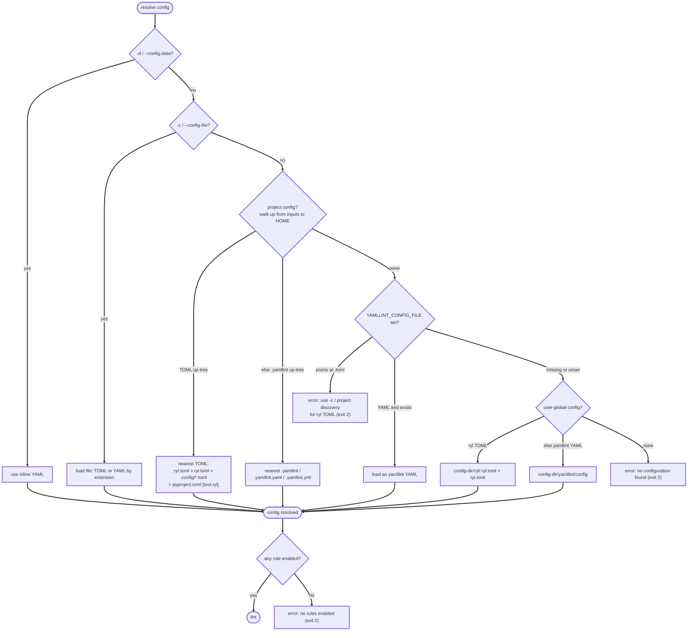

# Migrating from yamllint

ryl is designed as a drop-in replacement for yamllint's existing rule set.
If you are coming from yamllint you have two paths:

- **Keep your existing YAML configuration.** ryl reads `.yamllint`,
  `.yamllint.yml`, and `.yamllint.yaml` with the same semantics as upstream.
  No changes needed to get started.
- **Migrate to TOML.** TOML is the recommended format for ryl-specific
  features that have no upstream equivalent &mdash; for example the
  [`[fix]` table](#optional-configure-auto-fixes) controlling auto-fix
  selection.

## Automatic migration

ryl ships with a built-in converter. From the root of your project:

```bash
# Preview the converted TOML (no files written)
ryl --migrate-configs

# Write .ryl.toml next to each discovered .yamllint file
ryl --migrate-configs --migrate-write

# Write and remove the original YAML configs
ryl --migrate-configs --migrate-write --migrate-delete-old

# Write and rename the original YAML configs (e.g. .yamllint.bak)
ryl --migrate-configs --migrate-write --migrate-rename-old .bak
```

To migrate your **user-global** yamllint config (the personal defaults at
`<config-dir>/yamllint/config`) to ryl's own location
(`<config-dir>/ryl/ryl.toml`), use `--migrate-user-config`:

```bash
# Preview the user-global conversion
ryl --migrate-user-config

# Write it (creating the ryl/ directory if needed)
ryl --migrate-user-config --migrate-write

# Migrate project configs and the user-global config in one run
ryl --migrate-configs --migrate-user-config --migrate-write
```

Migrating the user-global config is optional: ryl still reads
`<config-dir>/yamllint/config` directly, so an unmigrated yamllint user-global
config keeps working.

Useful flags:

| Flag | Purpose |
| :--- | :--- |
| `--migrate-configs` | Migrate project-tree YAML configs |
| `--migrate-user-config` | Migrate the user-global yamllint config |
| `--migrate-root <DIR>` | Project search root (defaults to `.`) |
| `--migrate-stdout` | Print generated TOML to stdout instead of writing |
| `--migrate-write` | Write files (otherwise preview only) |
| `--migrate-rename-old <SUFFIX>` | Rename source YAML configs after migration |
| `--migrate-delete-old` | Delete source YAML configs after migration |

The `--migrate-write` / `--migrate-stdout` / `--migrate-rename-old` /
`--migrate-delete-old` flags apply to whichever migration trigger
(`--migrate-configs`, `--migrate-user-config`, or both) is set; `--migrate-root`
applies to project migration only.

Migration never overwrites or deletes through surprises: it skips (with a
warning, leaving the source untouched) any config whose target directory already
contains a ryl-native config (`.ryl.toml` or `ryl.toml`), and it refuses to
follow a symlink for either the source or the target (mirroring `--fix`). It also
refuses to overwrite an existing backup when `--migrate-rename-old` would clobber
one.

Known limitation: if a write is interrupted (for example, the disk fills mid
write), migration may leave a partial config file behind. The next run reports it
via the "a ryl-native config already exists" skip warning, so delete the partial
file and re-run.

Migration produces a self-contained config. A relative `extends` is flattened
(its rules are inlined), resolved relative to the config's own directory first,
then the current directory. The user-global config moves to a new directory
(`<config-dir>/ryl/`), so a top-level `ignore-from-file` is inlined as `ignore`
patterns there too, rather than left as a relative path that would no longer
resolve. A user-global config with a *rule-level* `ignore-from-file` is skipped
with a warning (inline those patterns or use an absolute path, then re-run),
since its rule config cannot be relocated safely. Project migration keeps a
relative `ignore-from-file` as-is, because the `.ryl.toml` stays in the same
directory.

After migration, run `ryl .` to confirm diagnostics match what yamllint
produced.

## What is preserved

- Rule names, defaults, and option semantics match yamllint's existing rule
  set.
- Diagnostic message text is kept aligned with yamllint where practical, so
  existing log scrapers continue to work.
- Configuration discovery walks the same locations as yamllint, with TOML
  formats checked in addition: an explicit `--config-file`, then a
  project-local `.ryl.toml`, `ryl.toml`, `pyproject.toml`, `.yamllint`,
  `.yamllint.yaml`, or `.yamllint.yml`, then the `YAMLLINT_CONFIG_FILE` env
  var, then a user-global config. At the user-global step ryl checks its own
  `<config-dir>/ryl/.ryl.toml` (or `ryl.toml`) first, then falls back to
  yamllint's `<config-dir>/yamllint/config` (see
  [ryl-native user-global config](#ryl-native-user-global-config) for how
  `<config-dir>` resolves per platform).
- `YAMLLINT_CONFIG_FILE` honours only a yamllint YAML config; pointing it at a
  `.toml` errors (see
  [`YAMLLINT_CONFIG_FILE` rejects TOML](#yamllint_config_file-rejects-toml)).
- The three built-in presets &mdash; `default`, `relaxed`, and `empty` &mdash;
  match yamllint's behaviour. YAML configs can still use `extends:` to
  reference them; TOML configs must inline the `default`/`relaxed` content (see
  the example below). `empty` has no usable TOML form because ryl rejects a
  config that enables no rules. The full preset content is in
  [Configuration presets](../config-presets.md).
- Inline `# yamllint disable` / `disable-line` / `enable` comments are honoured
  with the same grammar and semantics, so existing in-file suppressions keep
  working. The equivalent `# ryl …` spelling is preferred for new files; see
  [Inline directives](../directives.md).

## Configuration discovery precedence

ryl resolves the configuration governing **each file** it lints, trying these
sources in order and stopping at the first hit. `-d`/`-c` and
`YAMLLINT_CONFIG_FILE` pin a single config for the whole run; otherwise project
discovery runs per file, so a monorepo can hold many configs, each governing its
own subtree. ryl recognises the same config sources as yamllint (`-d`/`-c`,
project files, `YAMLLINT_CONFIG_FILE`, a user-global config) and adds ryl-native
TOML for `-c`, project discovery, and the user-global config (but not
`YAMLLINT_CONFIG_FILE`, which stays yamllint-YAML-only), but diverges in two ways
the diagram makes precise: yamllint
folds `YAMLLINT_CONFIG_FILE` into the user-global slot (the env var *replaces* it,
and a missing target falls through to `extends: default`), whereas ryl keeps the
env var and the user-global config as distinct fall-through tiers; and ryl
requires the resolved config to enable at least one rule or it exits `2` (yamllint
instead lints with its `default` preset when nothing is found, and silently
accepts a rule-less config):



## How ryl differs from yamllint

ryl is a drop-in replacement, but it intentionally diverges from yamllint in a
small number of places. Every divergence is deliberate: ryl is **more correct
against the YAML 1.2.2 specification**, it **fails loudly instead of silently**, or
it **avoids redundant output**. The complete list:

### No implicit default configuration

ryl never enables a rule unless a configuration explicitly turns it on. yamllint,
run with no configuration, lints with its `default` preset; ryl instead exits `2`
with `no configuration found`. It also exits `2` (`no rules enabled`) when a
resolved config turns every rule off, where yamllint would silently lint nothing.

**Why ryl differs:** linting with rules the user never asked for &mdash; or
silently doing nothing &mdash; is surprising. ryl makes the rule set explicit and
reports loudly when there isn't one. The presets stay available as explicit
opt-ins, so the one-line equivalent of yamllint's out-of-the-box behaviour is a
YAML config containing `extends: default` (or the corresponding TOML preset from
[Configuration presets](../config-presets.md)). The migration converter flattens an
`extends: default` source into the generated TOML automatically, and warns when a
migrated config ends up enabling no rules.

### Anchor and alias names containing a colon

YAML 1.2.2 §6.9.2 defines an anchor/alias name as `ns-anchor-char+`, and
`ns-anchor-char` excludes only the flow indicators `, [ ] { }` &mdash; so a colon
is a **legal name character**. ryl's parser and the
[YAML reference parser](https://play.yaml.com) both read a `:` as part of the
name; yamllint (via PyYAML) stops at the first `:`, which the specification does
not permit. ryl follows the spec, so the `anchors` rule can diverge:

| Input (with `&x`/`&foo…` as noted) | ryl (spec-conformant) | yamllint (PyYAML) |
| :--- | :--- | :--- |
| `b: {*x: 2}` | `*x:` is an **undeclared** alias; `x` is **unused** | reads `{x: 2}` &mdash; no diagnostic |
| `&foo:bar` and `&foo:baz` | two **distinct** anchors | one anchor `foo`, reported **duplicated** |
| `*foo:baz` | a valid alias named `foo:baz` | a **syntax error** (PyYAML cannot scan it) |

**Why ryl differs:** the YAML specification and its reference parser are the
authority, and PyYAML's narrowing at `:` is non-conformant (see
[adrienverge/yamllint#686](https://github.com/adrienverge/yamllint/issues/686) and
[adrienverge/yamllint#780](https://github.com/adrienverge/yamllint/issues/780)).
The portable, unambiguous way to use an alias as a mapping key is a **space before
the colon** &mdash; `*foo : bar` &mdash; which every parser reads identically. The
ryl-only [`anchors: forbid-ambiguous-anchor-alias-names`](../rules/anchors.md)
option flags welded colons so you can forbid the construct outright.

### De-duplicated inputs

When a single run names the same file more than once &mdash; listed twice, or reached
by both a directory argument and an explicit path (`ryl . file.yaml`) &mdash; ryl
processes it **once**. yamllint handles each occurrence, so it would report that
file's diagnostics (or, under `ryl --diff`, emit its patch) twice.

**Why ryl differs:** duplicate output is never useful, and it is actively harmful for
`--diff`, whose output is meant to be applied as a patch &mdash; a repeated patch
block fails to apply on the second copy. ryl normalizes each input path (lexically,
without resolving symlinks, so a symlink and its target stay distinct) and skips a
file it has already selected.

### Bare carriage-return (`\r`) line breaks

YAML 1.2.2 §5.4 defines a line break as `( CR LF ) | CR | LF`, so a **bare `\r`**
(a carriage return not followed by a line feed) is a complete line break on its own.
ryl honours this **everywhere** &mdash; every rule treats `\r`, `\r\n`, and `\n`
identically. yamllint's line layer counts `\n` only (a bare `\r` is ordinary
content), so on a classic-Mac `\r`-only file the two disagree:

| On a bare-`\r` line | ryl (YAML 1.2) | yamllint (`\n`-only) |
| :--- | :--- | :--- |
| spaces before the `\r` | `trailing-spaces` flags them | not flagged |
| a long line ending at `\r` | `line-length` measures to the `\r` | counts across the `\r` |
| a file ending in `\r` | `new-line-at-end-of-file` is satisfied | reports "no new line" |
| the file's first break is `\r` | `new-lines` flags it (not `unix`/`dos`) and `--fix` rewrites it | invisible (no `mac` type) |
| line/column of any diagnostic | counted CR-aware | shifted by uncounted `\r`s |

**On supported LF and CRLF files this is identical to yamllint** &mdash; the two
line-break definitions agree exactly when there is no bare `\r`. The divergence is
visible only on `\r`-only (or mixed-`\r`) files, which yamllint cannot lint
faithfully anyway (and whose `new-lines` `type` has no `mac` value). ryl follows the
specification and its [reference parser](https://play.yaml.com), which rank above
yamllint as the authority.

Two editing-path caveats on such files. First, `ryl --diff` skips a file whose
content *ends* in a bare `\r` (a unified diff is `\n`-terminated by format, so that
one case has no applicable patch &mdash; use `ryl --fix`, which rewrites bytes
directly); a bare `\r` elsewhere is diffed as line content and applies via
`git apply`. Second, **Markdown embedding** requires a Markdown file with no bare `\r` anywhere:
the fenced-block and front-matter parser
([`pulldown-cmark`](https://github.com/raphlinus/pulldown-cmark)) does not implement
CommonMark §2.1's bare-`\r` line ending, so a bare `\r` used as a host line ending
hides the YAML blocks from it, and a bare `\r` *inside* an embedded block (which the
parser keeps verbatim) can't be mapped back to a host position by ryl's `\n`-based
remap. Rather than silently check nothing — or report a wrong position — ryl reports
an error (and `--fix`/`--diff` skip with a notice) telling you to convert the file to
LF or CRLF. The YAML *inside* an LF/CRLF Markdown host (itself free of bare `\r`) is
linted CR-aware like any other.

### Per-line ignores

ryl adds a [`per-line-ignores`](../per-line-ignores.md) config table with no
yamllint counterpart: it suppresses chosen rules on lines (and/or files) matching a
regex/glob, the config-level complement to inline `# ryl disable-line`. yamllint
offers only inline directives and per-file path ignores, so a recurring exception
(every `#cloud-config`, every `# renovate:` marker) must be annotated in each file
or handled per-rule. Being ryl-only, it lives in TOML config and is rejected in
yamllint-compatible YAML config.

### Comment alignment to an open block level

yamllint's `comments-indentation` requires a standalone comment to match the
indentation of the content that follows it. ryl adds a ryl-only, off-by-default
[`comments-indentation: allow-any-open-indent`](../rules/comments-indentation.md)
option that *also* accepts a comment aligned to any still-open enclosing block
level &mdash; the pattern requested in
[adrienverge/yamllint#141](https://github.com/adrienverge/yamllint/issues/141),
which the maintainer welcomed but yamllint has not implemented:

```yaml
config:
    entry:
        - things
    # accepted under the option: marks the end of `entry:` at its open level
options:
    - more stuff
```

With the option off (the default) ryl matches yamllint exactly. Being ryl-only, the
option is configured in TOML and rejected in yamllint-compatible YAML config.

### Dash on its own line before a block mapping

yamllint's `hyphens` rule only limits the spaces after a `-`. ryl adds a ryl-only,
off-by-default [`hyphens: dash-on-own-line`](../rules/hyphens.md) option that requires a
block-sequence entry's `-` to be on its own line when the entry is a block mapping
&mdash; the spec-style "sequence of mappings" layout requested in
[adrienverge/yamllint#527](https://github.com/adrienverge/yamllint/issues/527), which
the maintainer welcomed but yamllint has not implemented:

```yaml
items:
  - name: web    # flagged under the option: mapping starts on the dash line
    port: 80
  -
    name: db     # accepted: dash alone, mapping body indented below
    port: 90
```

With the option off (the default) ryl matches yamllint exactly. Being ryl-only, the
option is configured in TOML and rejected in yamllint-compatible YAML config.

### JUnit and GitLab report formats

yamllint offers `standard`, `parsable`, `colored`, `github`, and `auto` output formats.
ryl keeps those and adds two machine-readable report formats: `--format junit` (JUnit XML)
and `--format gitlab` (GitLab Code Quality JSON), which write to stdout (or to a file with
`-o`/`--output-file`) so a Git forge can ingest them as a report artifact. Going beyond
yamllint, `--format` is repeatable and each pairs with its own `--output-file`, so a single
run can emit console diagnostics **and** one or more report files; the same targets can be
set in a ryl-only TOML `[output]` table. See [Output formats](../output-formats.md).

### ryl-native user-global config

yamllint's only user-global config lives at `$XDG_CONFIG_HOME/yamllint/config` (else
`~/.config/yamllint/config` on every platform). ryl still reads that path for migrators,
but checks its own `<config-dir>/ryl/.ryl.toml` (or `ryl.toml`) first, following the
ruff/Biome convention: `<config-dir>` is `$XDG_CONFIG_HOME` if set, else the platform-native
config dir (`~/.config/ryl` on Linux, `~/Library/Application Support/ryl` on macOS,
`%APPDATA%\ryl` on Windows). Being ryl-only, the ryl-native path is TOML; the
yamllint-compatible path stays YAML and, matching yamllint, always resolves under
`$XDG_CONFIG_HOME` or `~/.config` (not the native dir).

### `YAMLLINT_CONFIG_FILE` rejects TOML

`YAMLLINT_CONFIG_FILE` is yamllint's env var, so ryl honours it only as a yamllint
**YAML** config. Pointing it at a `.toml` errors (even when the file is absent),
directing you to `-c`/`--config-file` or project discovery for ryl-native TOML. A
YAML (or extension-less) target keeps full yamllint compatibility, including
yamllint's behaviour of **silently ignoring a missing target** and falling through
to the next config source.

| `YAMLLINT_CONFIG_FILE` target | ryl | yamllint |
| :--- | :--- | :--- |
| present `.toml` | **error** (use `-c`) | parsed as YAML (not TOML) |
| missing `.toml` | **error** (use `-c`) | ignored, falls through |
| missing `.yml`/`config` | ignored, falls through | ignored, falls through |

**Why ryl differs:** TOML is never a valid yamllint config, so there is no
compatibility to preserve for a `.toml` target &mdash; loading one through the
yamllint-named var was an accidental overlap with ryl's own format. ryl fails loudly
on it and keeps ryl-native TOML on its dedicated channels (`-c`/`--config-file`,
project discovery). yamllint's `-c` flag likewise errors on a missing file (only its
env var is lenient), and biome's `BIOME_CONFIG_PATH` errors on a missing target
outright, so failing loudly on the always-wrong `.toml` case is well-precedented.

## Side-by-side example

=== "yamllint (.yamllint)"

    ```yaml
    extends: default

    rules:
      line-length:
        max: 120
        allow-non-breakable-words: true
      quoted-strings:
        quote-type: double
        required: only-when-needed
      truthy: disable
    ```

=== "ryl (.ryl.toml)"

    ```toml
    [files]
    yaml = [
        "*.yaml",
        "*.yml",
        ".yamllint",
    ]

    [rules]
    anchors = "enable"
    braces = "enable"
    brackets = "enable"
    colons = "enable"
    commas = "enable"
    document-end = "disable"
    empty-lines = "enable"
    empty-values = "disable"
    float-values = "disable"
    hyphens = "enable"
    indentation = "enable"
    key-duplicates = "enable"
    key-ordering = "disable"
    new-line-at-end-of-file = "enable"
    new-lines = "enable"
    octal-values = "disable"
    quoted-strings = "disable"
    trailing-spaces = "enable"
    truthy = "disable"

    [rules.comments]
    level = "warning"

    [rules.comments-indentation]
    level = "warning"

    [rules.document-start]
    level = "warning"

    [rules.line-length]
    max = 120
    allow-non-breakable-words = true

    [rules.quoted-strings]
    quote-type = "double"
    required = "only-when-needed"
    ```

!!! note "TOML configuration is flat"

    TOML configuration does **not** support `extends`. Presets are expanded
    inline so the entire effective rule set is visible in one file. The
    `--migrate-configs` flag handles the expansion for you; if you write a
    TOML config by hand, start from the preset content in
    [Configuration presets](../config-presets.md).

## Optional: configure auto-fixes

TOML configurations can declare which rules are eligible for `ryl --fix`:

```toml
[fix]
fixable = ["ALL"]
unfixable = ["comments"]
```

This is a ryl-only feature. See the [Rules reference](../rules.md) for the
list of rules that support automatic fixing.

## Keeping both files

`.yamllint` and `.ryl.toml` can coexist. ryl prefers TOML when both are
present in the same directory, but a project that needs to remain
compatible with yamllint in CI can keep the YAML file authoritative and
treat the TOML file as supplemental for ryl-only features.
