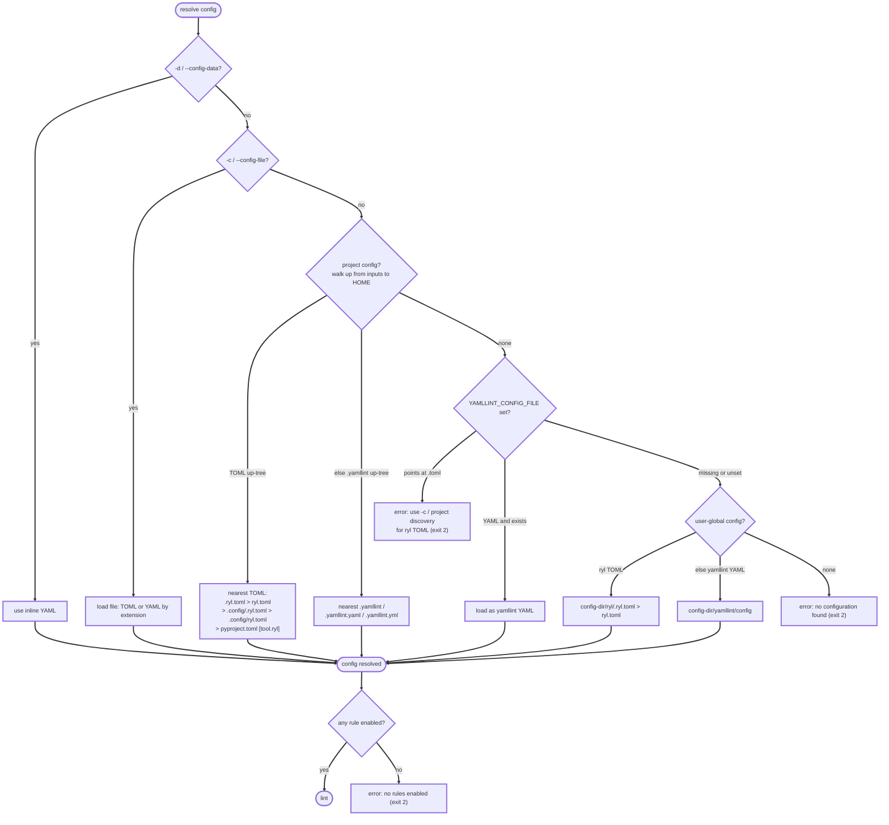

# Quick start

## The `ryl check` subcommand

ryl's CLI is moving to subcommands: `ryl check` is the lint pass (a dedicated
`ryl format` formatter is coming). `ryl check <paths>` is the recommended form and
is used throughout these docs. Bare `ryl <paths>` still lints identically today, but
it is being phased out — a future release will warn on it and a later one will remove
it, so adopt `ryl check` now.

## Run a lint

Point ryl at a file or directory:

```bash
# Lint a single file
ryl check path/to/file.yaml

# Lint a project (recursively scans .yml/.yaml, honouring .gitignore)
ryl check .
```

ryl does not enable any rules by default, so these commands report `no
configuration found` (exit `2`) until a configuration enables at least one rule.
To lint with yamllint's standard rule set straight away, pass it inline:

```bash
ryl check -d 'extends: default' .
```

or drop a config in your project (see [Configure for your
project](#configure-for-your-project) below).

## Lint from stdin

Pass `-` as the input to read YAML from standard input &mdash; useful for
editor integrations where the buffer is not yet on disk:

```bash
cat file.yaml | ryl check -

# Provide a filename so diagnostics, config discovery, and
# yaml-files / per-file-ignores match the right path:
cat file.yaml | ryl check - --stdin-filename path/to/file.yaml
```

Without `--stdin-filename`, diagnostics are labelled `<stdin>`, config
discovery is anchored at the current working directory, and all
path-based filtering (`yaml-files`, per-file-ignores, per-rule `ignore`
patterns) is skipped so every enabled rule runs. `-` cannot be combined
with other inputs, and `--fix` cannot read from stdin (use `--diff` to
preview fixes instead).

Exit codes:

- `0` &mdash; no problems found.
- `1` &mdash; lint errors, invalid YAML, or a path that could not be read
  (including nonexistent files).
- `2` &mdash; CLI usage error (no inputs provided, bad flags), or
  `--strict` was set and only warnings were produced.

ryl never enables a rule unless a configuration explicitly turns it on, so two
cases exit `2` rather than silently linting nothing:

- **No configuration found** anywhere (no `-c`/`-d`, no `YAMLLINT_CONFIG_FILE`, no
  discovered `.ryl.toml`/`.yamllint`). Create a config that enables rules, or pass a
  YAML config with `extends: default` for yamllint's standard rule set.
- **A configuration that enables no rules** (`rules: {}`, an empty
  `[rules]`/`[tool.ryl]`, or one disabling everything). Enable at least one rule, or
  use `extends: default`.

This is stricter than yamllint, which lints with the `default` preset when no config
is found and silently accepts a rule-less config. Give ryl a config containing
`extends: default` to reproduce yamllint's out-of-the-box behaviour.

## Apply auto-fixes

ryl can automatically fix a subset of rules:

```bash
ryl check --fix .
```

See the [Rules reference](../rules.md) for which rules are fixable.

`--fix` rewrites files in place but never writes through a symlink: a
symlinked input is linted but skipped for fixing (with a warning on
stderr), so a symlink in an untrusted tree cannot redirect a write to a
file outside it. This mirrors directory scanning, which does not follow
symlinks.

## Preview fixes as a diff

`--diff` runs the same safe fixes as `--fix` but, instead of writing,
prints a unified diff (3 lines of context) of what would change to
stdout &mdash; modelled on `ruff check --diff`:

```bash
ryl check --diff .
```

This is handy for CI previews, PR review, and parallel-safe runners such
as [hk](https://hk.jdx.dev) that apply the diff themselves rather than
re-invoking the linter. `--diff` never modifies files, is mutually
exclusive with `--fix`, and (unlike `--fix`) works with `-`/stdin.

Like `ruff check --diff`, the exit code reflects only the diff &mdash;
remaining *unfixable* findings are neither printed nor counted:

- `1` &mdash; at least one file would change.
- `0` &mdash; no file would change.
- `2` &mdash; CLI usage error.

A file that cannot be parsed (or a symlink) is skipped with a notice on
stderr and does not affect the exit code. A non-UTF-8 or BOM-prefixed file
is also skipped: a textual diff of its decoded content could not be applied
back to the original bytes, so use `--fix` (which preserves the encoding)
for those. For embedded YAML in Markdown, the diff is reported at the
host-file level (one diff per `.md`).

## Configure for your project

The recommended TOML config is deliberately **explicit** and **local**: it has
no default-on rules and no `extends`/inheritance, so a single `.ryl.toml`
(discovered by searching upward, and preferred over a `.yamllint`) is the
entire ruleset for the files beneath it; a monorepo can have many, each
governing its subtree. A yamllint-style YAML config instead keeps yamllint
semantics, where `extends:` merges in a preset or another file. When no
project config is found, ryl falls back to a single user-global config (see
below). Either way there are no default-on rules, so a config that enables
nothing exits `2` rather than silently linting nothing.

Drop a `.ryl.toml` (or `ryl.toml`) at the root of your repo. TOML
configuration is flat &mdash; copy the preset you want from
[Configuration presets](../config-presets.md) and customise from there:

```toml
[files]
yaml = [
    "*.yaml",
    "*.yml",
    ".yamllint",
]

# ... rule enable/disable table from the preset ...

[rules.line-length]
max = 120
allow-non-breakable-words = true
```

YAML configuration is also accepted for parity with yamllint and supports
`extends:` for selecting a preset. Both `.yamllint` and `.ryl.toml` are
discovered automatically. TOML is the recommended format for ryl-specific
features (such as fix selection) that have no upstream yamllint
equivalent.

To keep config out of the project root, ryl also discovers a ryl-native TOML
config inside a repo-local `.config/` directory (the RuboCop/rumdl convention).
At each directory in the upward search the candidates are tried in this order,
and the first match wins:

1. `.ryl.toml`
2. `ryl.toml`
3. `.config/.ryl.toml`
4. `.config/ryl.toml`
5. `pyproject.toml` (only when it has a `[tool.ryl]` table)

`.config/` holds ryl-native TOML only: the legacy `.yamllint`/`.yamllint.yaml`/
`.yamllint.yml` files are discovered at the directory level, never inside
`.config/`. A `.config/ryl.toml` is a true drop-in for a root `ryl.toml`: its
`[files]`/`ignore` globs and relative `ignore-from-file` paths resolve against
the project root (the directory containing `.config/`), not `.config/` itself.

If you already have a yamllint configuration, use the built-in converter:

```bash
ryl --migrate-configs --migrate-write
```

See [Migrating from yamllint](migrating-from-yamllint.md) for details.

## Configure across projects (user-global)

When no project config is found, ryl falls back to a user-global config so you
can set personal defaults once. It reads its own TOML config first &mdash;
`<config-dir>/ryl/.ryl.toml` (or `ryl.toml`), following the ruff/Biome
convention where `<config-dir>` is `$XDG_CONFIG_HOME` if set, else the
platform-native config dir (`~/.config/ryl` on Linux, `~/Library/Application
Support/ryl` on macOS, `%APPDATA%\ryl` on Windows) &mdash; then falls back to
yamllint's `<config-dir>/yamllint/config` for compatibility. A project config,
`-c`/`-d`, or `YAMLLINT_CONFIG_FILE` all take precedence over the user-global
config. `YAMLLINT_CONFIG_FILE` accepts only a yamllint YAML config (pointing it
at a `.toml` errors); use `-c`/`-d` or project discovery for ryl-native TOML.

If you have a yamllint user-global config, `ryl --migrate-user-config
--migrate-write` converts it to the ryl-native `ryl.toml` (see [Migrating from
yamllint](migrating-from-yamllint.md)). Migration is optional, since ryl also
reads the yamllint location directly.

## Configuration precedence

ryl resolves the configuration governing **each file** it lints, trying these
sources in order and stopping at the first hit. `-d`/`-c` and
`YAMLLINT_CONFIG_FILE` pin a single config for the whole run; otherwise project
discovery runs per file, so a monorepo can hold many `.ryl.toml` files, each
governing its own subtree. The winning config must enable at least one rule, or
ryl exits `2`:


